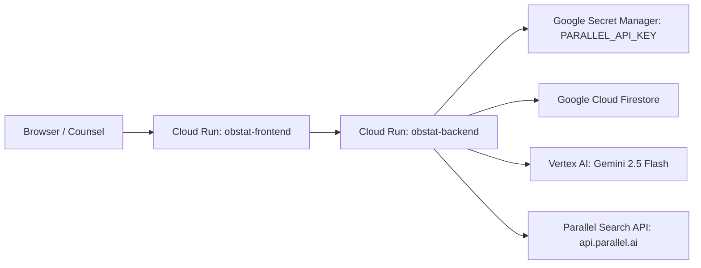

# Deployment & Cloud Infrastructure Guide — OBSTAT

> **Status:** `DEPLOYMENT_NOT_PROVEN`  
> In accordance with cold audit policy, no live Cloud Run service is claimed as active production until public HTTPS URLs are provisioned and live health checks succeed. The architecture below specifies the Google-first deployment contract for Google Cloud Run, Secret Manager, Cloud Firestore, and Vertex AI.

---

## 1. Cloud Architecture Overview



### Components:
- **Frontend Container:** Next.js 15 standalone server running on Google Cloud Run (`PORT=3000`). Configured at build time with `NEXT_PUBLIC_API_BASE`.
- **Backend Container:** FastAPI Python 3.12 application on Google Cloud Run (`PORT=8080`).
- **Secret Manager:** Hosts `parallel-api-key` securely mounted as `PARALLEL_API_KEY` into Cloud Run backend container.
- **Database:** Google Cloud Firestore (multi-region / native mode) storing project, revision, claim, occurrence, evidence, and audit logs.
- **AI / LLM:** Google Cloud Vertex AI (`gemini-2.5-flash`, region `us-central1`) via Google Application Default Credentials (ADC) or service account identity.

---

## 2. Step-by-Step Production Deployment Commands

### Step A: Configure Project & Service Identity
```bash
export GOOGLE_CLOUD_PROJECT="project-2ac1d1fb-7da1-46b4-90e"
export REGION="us-central1"

# Create dedicated service account for OBSTAT runtime
gcloud iam service-accounts create obstat-runner \
  --display-name="OBSTAT Cloud Run Runner Service Account"

# Grant least-privilege roles (Vertex AI User + Cloud Datastore User)
gcloud projects add-iam-policy-binding $GOOGLE_CLOUD_PROJECT \
  --member="serviceAccount:obstat-runner@$GOOGLE_CLOUD_PROJECT.iam.gserviceaccount.com" \
  --role="roles/aiplatform.user"

gcloud projects add-iam-policy-binding $GOOGLE_CLOUD_PROJECT \
  --member="serviceAccount:obstat-runner@$GOOGLE_CLOUD_PROJECT.iam.gserviceaccount.com" \
  --role="roles/datastore.user"
```

### Step B: Store Parallel Search API Key in Secret Manager
```bash
# Create secret in Google Secret Manager
gcloud secrets create parallel-api-key --replication-policy="automatic"

# Add active rotated credential version
echo -n "$PARALLEL_API_KEY" | gcloud secrets versions add parallel-api-key --data-file=-

# Grant service account access to secret
gcloud secrets add-iam-policy-binding parallel-api-key \
  --member="serviceAccount:obstat-runner@$GOOGLE_CLOUD_PROJECT.iam.gserviceaccount.com" \
  --role="roles/secretmanager.secretAccessor"
```

### Step C: Build & Deploy Backend Microservice
```bash
cd backend
gcloud builds submit --tag gcr.io/$GOOGLE_CLOUD_PROJECT/obstat-backend:latest

gcloud run deploy obstat-backend \
  --image gcr.io/$GOOGLE_CLOUD_PROJECT/obstat-backend:latest \
  --platform managed \
  --region $REGION \
  --service-account="obstat-runner@$GOOGLE_CLOUD_PROJECT.iam.gserviceaccount.com" \
  --set-env-vars="OBSTAT_MODE=PRODUCTION,ALLOW_DEMO_SEED=False,DB_TYPE=FIRESTORE,GOOGLE_CLOUD_PROJECT=$GOOGLE_CLOUD_PROJECT,GOOGLE_CLOUD_LOCATION=$REGION" \
  --set-secrets="PARALLEL_API_KEY=parallel-api-key:latest" \
  --allow-unauthenticated
```
Capture the resulting backend URL (e.g. `https://obstat-backend-xxxx-uc.a.run.app`).

### Step D: Build & Deploy Frontend Web Application
```bash
cd ../frontend
export BACKEND_URL="https://obstat-backend-xxxx-uc.a.run.app"

gcloud builds submit \
  --substitutions=_NEXT_PUBLIC_API_BASE="$BACKEND_URL" \
  --tag gcr.io/$GOOGLE_CLOUD_PROJECT/obstat-frontend:latest

gcloud run deploy obstat-frontend \
  --image gcr.io/$GOOGLE_CLOUD_PROJECT/obstat-frontend:latest \
  --platform managed \
  --region $REGION \
  --set-env-vars="NEXT_PUBLIC_API_BASE=$BACKEND_URL" \
  --allow-unauthenticated
```

---

## 3. Deployment Invariant Verification Checklist

1. [ ] **No Localhost Fallback:** Production frontend must fail immediately if `NEXT_PUBLIC_API_BASE` is omitted or empty.
2. [ ] **No Fallback Regex Parser:** Backend running with `OBSTAT_MODE=PRODUCTION` must raise `SemanticExtractionError` on extraction model failure.
3. [ ] **No Hardcoded Secrets:** `PARALLEL_API_KEY` injected exclusively via Secret Manager.
4. [ ] **Durable Persistence:** Firestore collections survive complete Cloud Run container restarts without SQLite dependency.
