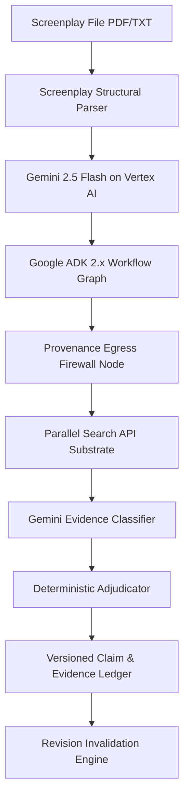

# OBSTAT — Devpost Submission & Hackathon Presentation Guide

> **Tagline:** Continuous Clearance Evidence Control for Film & Television Productions  
> **Track:** Parallel Track (Grounding & Search for Agentic Cinema)  
> **Google Stack:** Google Cloud Platform, Gemini Enterprise Agent Platform, Vertex AI (`gemini-2.5-flash`), Google ADK 2.x, Firestore, Cloud Run (Target Deployment Architecture)  
> **Partner Substrate:** Parallel Search API (`api.parallel.ai/v1/search`)  
> **Deployment Status:** `DEPLOYMENT_NOT_PROVEN` on live Cloud Run; 100% reproducible via documented local runner  
> **GitHub Repository:** [https://github.com/winsznx/obstat.git](https://github.com/winsznx/obstat.git)  

---

## 🎬 1. Elevator Pitch (The Core Idea)

In entertainment production, script clearance is a legal nightmare. A single script revision—renaming a character, changing a record label, or adding a brand—invalidates previous clearance reports. Production lawyers waste hundreds of hours manually re-researching identical entities or missing newly introduced legal risks.

**OBSTAT solves this forever.** By binding live web search evidence directly to screenplay line offsets, OBSTAT transforms clearance into continuous change control:
- **Change the script**, and OBSTAT instantly retains valid evidence for unchanged claims (saving 55% of queries on the controlled revision benchmark).
- **Rename or alter an entity**, and OBSTAT automatically invalidates stale evidence, blocks the clearance research packet, and executes targeted incremental research via the Parallel Search API.

---

## 🏗️ 2. Technical Architecture & Google Stack



### Key Technical Innovations:
1. **Google ADK 2.x Graph Workflow**: Instantiates genuine `google.adk.Agent` and `google.adk.Workflow` primitives, coordinating Vertex AI Gemini 2.5 Flash for entity extraction with deterministic governance tools for policy enforcement.
2. **Provenance Egress Firewall**: Protects unreleased screenplay IP by guaranteeing that no raw script dialogue or plot context ever leaves GCP. Outbound search queries are compiled using strict token whitelists (`ITEM_TOKEN`, `TEMPLATE_TOKEN`, `SCOPE_TOKEN`).
3. **Fail-Closed Evidence Policy**: Zero usable search results = `INSUFFICIENT_COVERAGE`. OBSTAT refuses to make false negative claims or issue "clean" reports based on thin web data.

---

## 📊 3. Measured Policy Conformance Evidence (200 Controlled Cases)

OBSTAT was evaluated across **200 controlled test cases** (Reference Policy & Invariant Suite):

| Campaign | Total Cases | Policy Conformance | Key Outcome |
|---|---|---|---|
| **Evidence & Adjudication** | **100** | **100.0%** | Zero false negative clearance claims; 100% fail-closed policy compliance |
| **Revision Invalidation** | **100** | **100.0%** | 55.0% differential search reduction on the controlled benchmark; 100% stale claim detection across mutations |

Raw machine-readable benchmark outputs are available in `schemas/evidence_benchmark_results.json` and `schemas/revision_benchmark_results.json`.

---

## 📹 4. 3-Minute Demo Video Script

- **[0:00 - 0:35] Problem & Hero Toggle**: Show public landing page (`/`). Toggle from Draft 12 to Draft 13 in the hero widget. Point out how `MERCER VALE RECORDS` instantly turns Orange (`STALE_SCRIPT`), blocking the research packet.
- **[0:35 - 1:15] Onboarding & Screenplay Workspace**: Open the Onboarding Wizard (`Start a Production`). Select production scope (US + Global Theatrical & Streaming). Navigate to the three-column screenplay review workspace (`/app`).
- **[1:15 - 2:00] Claim Inspector & Parallel Search**: Click on `VELA RECORDS`. Point out the **Decision Summary Card** explaining why it matched `velarecords.com`. Click **Research Alternatives** to show live candidate generation and Parallel Search execution.
- **[2:00 - 2:30] Revision Invalidation Engine**: Switch to `/app/revision_diff`. Show side-by-side diff between Draft 12 and Draft 13. Point out 3 Retained Claims (zero search cost) vs 1 Stale Claim (`MERCER VALE RECORDS`).
- **[2:30 - 3:00] Research Packet & Assurance Audit**: Open `/app/packet`. Show the Script Clearance Research Packet with SHA-256 integrity hash. Navigate to `/app/assurance` to show the real-time Egress Audit Log proving zero script text left GCP.

---

## 🛠️ 5. Reproduction & Test Execution

Run the complete test & benchmark suite locally:

```bash
# 1. Run Backend Unit Tests (17/17 OK)
backend/venv/bin/python3 -m unittest discover -s backend/tests

# 2. Run 200-Case Proof Benchmarks
backend/venv/bin/python3 backend/tests/run_proof_benchmarks.py

# 3. Run Security & Adversarial Suite (6/6 OK)
backend/venv/bin/python3 backend/tests/test_security_adversarial.py

# 4. Run ADK Live Workflow Verification (Emits schemas/adk_run_trace.json)
backend/venv/bin/python3 backend/tests/verify_adk_execution.py

# 5. Run Playwright Deterministic UI Workflow Tests (3/3 Passed)
cd frontend && pnpm exec playwright test
```

---

## ⚖️ 6. Honest Limitations & Scope

OBSTAT provides decision support and continuous evidence change control for production attorneys and clearance coordinators. It does **not** grant E&O insurance policies or issue binding legal advice without human counsel disposition.
