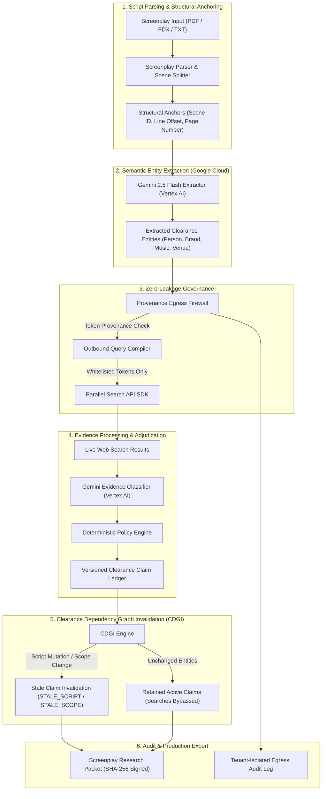

# OBSTAT: Continuous Clearance Evidence Control for Film Productions

> Change the screenplay, and stale clearance evidence cannot silently survive.

OBSTAT is an enterprise-grade clearance evidence control and invalidation platform for film and television productions. Built on **Google Cloud (Vertex AI, Google Application Development Kit 2.x, Firestore)** and the **Parallel Search API**, OBSTAT transforms raw screenplay entities into versioned, auditable clearance claims. It queries live web data through a zero-leakage egress firewall, adjudicates evidence against strict coverage policies, and automatically revokes stale clearance evidence whenever script revisions or research scopes change.

Built for the **Google Cloud Agentic Cinema: The Blockbuster Hackathon** (Parallel Track).

---

## Architecture & System Topology



---

## Core System Invariants

1. **Fail-Closed Policy Adjudication**: Unusable, missing, or verbatim-unmatched search evidence never produces a negative clearance claim. Claims lacking sufficient verified evidence resolve to `INSUFFICIENT_COVERAGE` or `MATCH_FOUND`, requiring explicit counsel disposition.
2. **Models Reason, Code Governs**: Generative AI models perform semantic entity extraction and verbatim text matching. Deterministic code strictly enforces query white-listing, policy adjudication, claim invalidation, and packet integrity signatures.
3. **Screenplay Privacy Guarantee**: Raw screenplay text never leaves Google Cloud infrastructure. Outbound search queries to the Parallel Search API undergo token-level provenance verification (`ITEM_TOKEN`, `TEMPLATE_TOKEN`, `SCOPE_TOKEN`) prior to transmission.
4. **Server-Side Tenant & Project Isolation**: All persistence operations (SQLite / Google Cloud Firestore) enforce strict `project_id` scoping at the data layer. Project A cannot access, query, or leak Project B egress logs or clearance ledgers.

---

## Primary Product Surfaces

- **Product Landing Page (`/`)**: Core thesis, interactive CDGI mechanism architecture demonstration (bound to sample project `proj_starlight_01`), 3-tier clearance problem breakdown, and lifecycle specifications.
- **Production Onboarding Wizard**: Guided project creation, multi-territory distribution scope configuration (US, UK, CA, EU, GLOBAL), and script upload pipeline.
- **Clearance Workspace (`/app`)**: Screenplay viewer rendered in Courier Prime typography with semantic status highlighting (Mint Green for `NO_MATCH_FOUND_IN_SCOPE`, Amber for `INSUFFICIENT_COVERAGE`, Red for `MATCH_FOUND`, Orange for `STALE_SCRIPT`), Decision Summary Card, Unusable Evidence Inspector, and **Interactive Alternative Name Research via Parallel Search API**.
- **Revision Invalidation Engine (`/app/revision_diff`)**: Side-by-side Draft N vs. Draft N+1 differential engine displaying retained active claims, stale script/scope claims, query reduction metrics, and cost savings.
- **Screenplay Research Packet (`/app/packet`)**: Production-ready clearance research report with SHA-256 integrity hash verification and JSON package export for legal counsel sign-off.
- **Assurance & Egress Governance (`/app/assurance`)**: Real-time server-side audited egress log capturing all outbound query tokens, token classifications, and Parallel Search IDs.

---

## Measured Policy Conformance Benchmarks

OBSTAT was evaluated against **200 controlled test cases** across two automated benchmark suites:

| Benchmark Campaign | Evaluation Cases | Policy Conformance | Measured Performance Metric |
|---|---|---|---|
| **Evidence & Policy Adjudication** | **100** | **100.0%** | Zero false-negative claims; 100% fail-closed compliance under absent/unusable evidence |
| **Revision Invalidation (CDGI)** | **100** | **100.0%** | 55% query reduction on controlled revision benchmarks; 100% stale claim detection across entity mutations |

Artifact manifests: `schemas/evidence_benchmark_results.json`, `schemas/revision_benchmark_results.json`, and `evidence/calibration_report.md`.

---

## Setup & Verification

OBSTAT supports three distinct evaluation modes.

### 1. Deterministic / Offline Mode (No External Credentials)
Runs unit tests, screenplay parsing, counterfactual invalidation, and security adversarial suites locally:

```bash
cd backend
python3 -m venv venv
source venv/bin/activate
pip install -r requirements.txt
./venv/bin/pytest tests/
```

### 2. Local Live-Provider Mode (Vertex AI + Parallel API)
Requires active Google Cloud ADC credentials with `roles/aiplatform.user` (*Vertex AI User*) on project `project-2ac1d1fb-7da1-46b4-90e` and a `PARALLEL_API_KEY`.

Execute local preflight diagnostics prior to launching:

```bash
cd backend
./venv/bin/python scripts/preflight_check.py
```

Launch production backend:

```bash
export OBSTAT_MODE=PRODUCTION
./venv/bin/python main.py
```

### 3. Hosted Cloud Run Deployment
Deployed infrastructure running on Google Cloud Run:

- **Frontend App:** `https://obstat-frontend-586563372673.us-central1.run.app`
- **Backend API:** `https://obstat-backend-586563372673.us-central1.run.app`
- **Preflight Diagnostic:** `https://obstat-backend-586563372673.us-central1.run.app/api/system/preflight`
- **Sample Endpoint:** `https://obstat-backend-586563372673.us-central1.run.app/api/projects/sample`

---

## Disclaimer

OBSTAT accelerates legal clearance workflows and structures evidence for production counsel. It does not provide legal opinions, issue Errors & Omissions (E&O) insurance policies, or replace licensed entertainment legal counsel.

---

## License

This project is licensed under the Apache License 2.0. See [LICENSE](LICENSE) for details.
