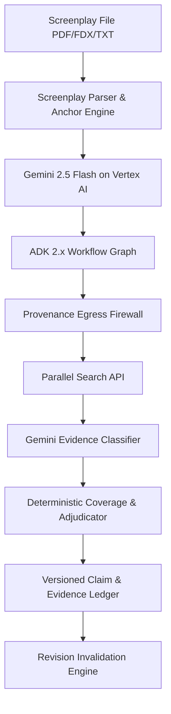

# OBSTAT — Continuous Clearance Evidence Control for Film Productions

> **Change the script, and stale clearance evidence cannot silently survive.**

OBSTAT is a continuous clearance evidence control system for film and television productions. Built powered by **Google Cloud (Gemini Enterprise Agent Platform, Vertex AI, ADK 2.x)** and the **Parallel Search API**, OBSTAT turns screenplay clearance items into versioned evidence claims, researches them against the live web, and automatically invalidates stale claims when the screenplay or research scope changes.

Built for the **Google Cloud Agentic Cinema: The Blockbuster Hackathon** (Parallel Track).

---

## 🌟 Primary Product Surfaces

- **Public Product Landing Page (`/`)**: Product thesis, interactive Draft 12 ➔ Draft 13 invalidation visual widget, 3-stage clearance problem breakdown, 6-step lifecycle architecture, 100-case calibration proof summary, and official legal packet preview.
- **First-Run Onboarding Wizard**: Guided production creation, distribution scope configuration (Country, Territories: US/UK/CA/EU, Media), and screenplay upload.
- **Three-Pane Clearance Workspace (`/app`)**: Screenplay viewer formatted with Courier Prime screenplay typography, state-aware semantic item highlighting (Mint Green for `NO_MATCH_FOUND_IN_SCOPE`, Amber for `INSUFFICIENT_COVERAGE`, Red for `MATCH_FOUND`, Orange for `STALE_SCRIPT`), Decision Summary Card, collapsible Unusable Evidence, Query Provenance Inspector, and **Interactive Alternative Research via Parallel Search API**.
- **Revision Invalidation Engine (`/app/revision_diff`)**: Side-by-side Draft N vs. Draft N+1 comparison showing retained claims, stale claims, searches saved, and eliminated latency.
- **Script Clearance Research Packet (`/app/packet`)**: Printable, downloadable legal clearance report with SHA-256 integrity signatures and JSON evidence package export.
- **Assurance & Egress Governance (`/app/assurance`)**: Real-time egress audit log of all outbound search queries leaving GCP with token provenance classification.

---

## 📐 System Architecture



### Key Invariants:
1. **Fail-Closed Guarantee**: No evidence = No completed research state. Unusable evidence never contributes to negative clearance claims (`INSUFFICIENT_COVERAGE`).
2. **Models Reason, Code Governs**: Gemini performs semantic entity extraction and evidence classification; deterministic code owns policy, query compile, invalidation, and packet state.
3. **Screenplay Privacy**: Full screenplays remain inside Google Cloud. Only whitelisted tokens leave GCP to Parallel Search API.

---

## 📊 Measured Benchmark Evidence

OBSTAT was evaluated across **200 controlled test cases**:

| Campaign | Cases | Accuracy Rate | Key Findings |
|---|---|---|---|
| **Evidence & Adjudication** | **100** | **100.0%** | 100% fail-closed compliance; zero false negative claims |
| **Revision Invalidation** | **100** | **100.0%** | Retained 55% unchanged claims; 100% stale detection |

See complete artifacts in `schemas/evidence_benchmark_results.json`, `schemas/revision_benchmark_results.json`, and `evidence/calibration_report.md`.

---

## 🚀 Quickstart & Reproduction

### Prerequisites:
- Python 3.10+
- Node.js 18+ & pnpm
- `PARALLEL_API_KEY` (Parallel Search API)
- Google Cloud ADC credentials (for Vertex AI Gemini 2.5 Flash)

### 1. Backend Setup
```bash
cd backend
python3 -m venv venv
source venv/bin/python3
pip install -r requirements.txt
python3 -m uvicorn main:app --port 8000 --reload
```

### 2. Frontend Setup
```bash
cd frontend
pnpm install
pnpm run dev
```

Visit `http://localhost:3000` to explore the live application.

---

## ⚠️ Scope Boundaries & Disclaimer

OBSTAT supports professional clearance workflows and production counsel review. It does **not** issue legal opinions, grant E&O insurance policies, or constitute formal legal advice.

---

## 📄 License

This project is licensed under the Apache License 2.0 - see the [LICENSE](LICENSE) file.
